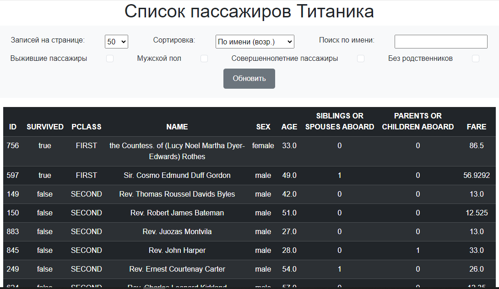

## ТЗ выполнено.

### Описание работ
- Приложение работает на Spring Cloud: 3 отдельных микросервиса (Eureka, Backend, Frontend).
- Бэкенд работает c БД PostgreSQL 12 посредством Spring Data JPA. 
- Миграциями управляет Liquibase.
- Реализовано кэширование с помощью Redis. 
- Подключено логирование logback.
- Фронтенд реализован на шаблонах Thymeleaf с использованием HTML/CSS/JS. 

Фронтенд, получая запрос, обращается за данными в свои сервисы, а они шлют HTTP запросы к Бэкенду.
Хотел сделать красиво и разместить на своём сервере через докер, но запутался в адресации - ловлю Connection refused.

### Скриншот страницы

### Развёртывание
Сначала нужно получить исходники: git clone https://github.com/pablos-v/Titanic
\
Далее, в файле Backend/src/main/resources/application.yaml в properties можно изменить 2 параметра:
\
URL: https://web.stanford.edu/class/archive/cs/cs109/cs109.1166/stuff/titanic.csv
\
adultAgeCriteria: 16 

Для развёртывания приложения необходимо иметь запущенные БД Postgres и Redis, соответствующие описанию из docker-compose.yaml
Достаточно запустить для этого команду docker-compose up. 

Контейнеры модулей "подружить" в docker-compose не удалось (буду очень благодарен, если укажете где ошибка).
\
Модули запускаются вручную консольными командами из общей папки:
- mvn -f Eureka clean package && java -jar Eureka/target/Eureka-0.0.1.jar 
- mvn -f Backend clean package && java -jar Backend/target/Backend-0.0.1.jar 
- mvn -f Frontend clean package && java -jar Frontend/target/Frontend-0.0.1.jar
Страница будет доступна по адресу: http://localhost:8089

### Примечания
По пагинации: изначально хотел реализовать через Thymeleaf, чтобы каждая страница формировалась новыми запросами типа /?page=
\
Но потом подумал, что каждый раз слать запрос и отрисавывать страницу при таком малом объёме данных - так себе идея. 
\
Лучше сразу передавать весь отфильтрованный список, и уже на месте сделать пагинацию через JS. 
\
Сам я на JS писать не умею - нашёл готовое решение и подружил с шаблоном Thymeleaf.

### Возможные оптимизации
- бэкенд в ответе возвращает индикаторы фильтров, которые были в запросе - на их основе можно сделать на странице отображение всех параметров отправленного запроса - сейчас это можно понять только по адресной строке, а все фильтры сбрасываются на значения по умолчанию.
- создать стартер содержащий дублирующиеся DTO и Enum, чтобы избежать дублирования кода
- разобраться с docker-compose и таки задеплоить
- свести все переменные вроде http://localhost:8761/eureka и Url файла в .env файл, и добавить их в environment докерфайлов

